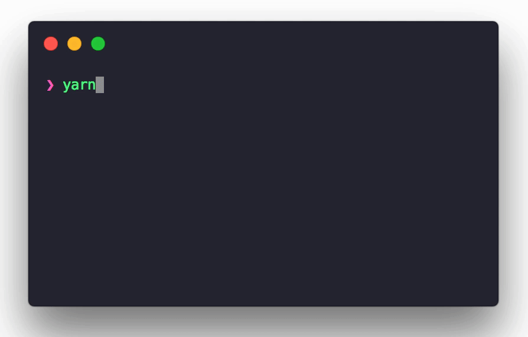

# execa-output

> A utility to display command output when using [execa](https://www.npmjs.com/package/execa) with [listr](https://www.npmjs.com/package/listr).

`execa-output` is responsible for creating the output sub text, like `→ text`, as seen in the screenshot below.



## Install

### NPM

```
$ npm i execa-output
```

### Yarn

```
$ yarn add execa-output
```

## Usage

```js
const execa = require('execa');
const execao = require('execa-output');
const Listr = require('listr');

const tasks = new Listr([
    {
        task: () => execa('some', ['command']),
        title: 'Comamnd without output or output you do not care to show'
    },
    {
        task: () => execao('some', ['other', 'command']),
        title: 'Command with output you want to show'
    }
]);

tasks.run().catch((error) => {
    console.error(error);
});
```

## Credit

I use [np](https://github.com/sindresorhus/np) to release npm packages and I have always :heart: it's simple, elegant presentation. It's how I learned about [execa](https://github.com/sindresorhus/execa) and [listr](https://github.com/SamVerschueren/listr), which I now use to build a lot of my own, custom [npm scripts](https://docs.npmjs.com/misc/scripts).

There's [an issue on listr](https://github.com/SamVerschueren/listr/issues/90) where people wanted to know how to display long running task output and [it was recommended](https://github.com/SamVerschueren/listr/issues/90#issuecomment-382702459) that one could reimplement / resue [the code np uses](https://github.com/sindresorhus/np/blob/5d923655a3986d04ea14035d20d5c0c16964b7fe/index.js#L17-L25).

This is exactly why `execa-output` was created.

All credit for this code goes to @sindresorhus and @SamVerschueren for the original implementation. :pray: I simply modularized it for reuse.

## License

MIT © [Michael Novotny](https://manovotny.com)
